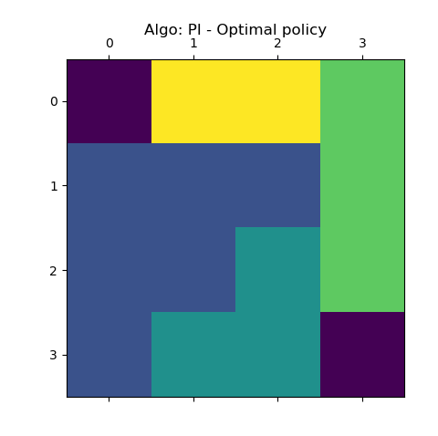
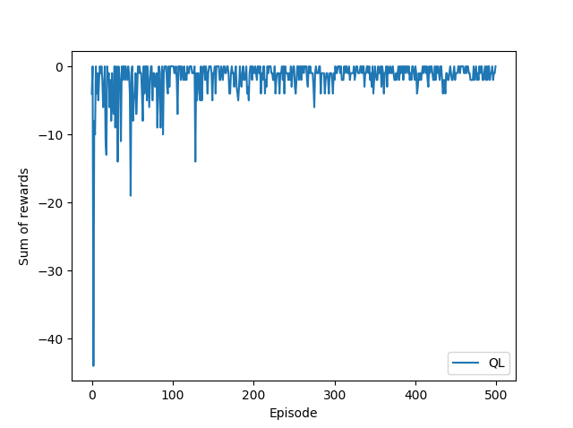
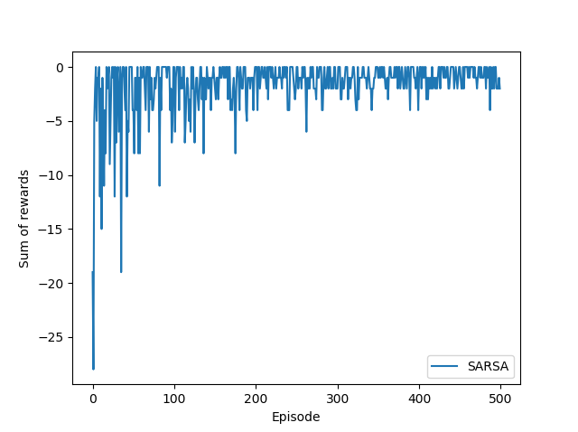

# Reinforcement learning algorithms 

For this practical work in my Reinforcement Learning class, we had to implement a few reinforcement learning algorithms. The `py` files were provided to us and we had to complete `new_agent.py` with our implementations.

## 1. Value Iteration + Policy Iteration
To test the Value / Policy iteration algorithms, we used the
standard *Grid world* environment (inspired from Sutton's Reinforcement Learning book, chapter 4).

You are an agent on an MxN grid and your goal is to reach the terminal
state at the top left or the bottom right corner.

For example, a 4x4 grid looks as follows:

    T  o  o  o

    o  x  o  o

    o  o  o  o

    o  o  o  T

x is your position and T are the two terminal states.

You can take actions in each direction (UP=0, RIGHT=1, DOWN=2, LEFT=3).
Actions going off the edge leave you in your current state.
You receive a reward of -1 at each step until you reach a terminal state.

### Policy learned by the Value Iteration algorithm

(Violet: terminal state | Blue: go up, yellow: go left, light green: go down, dark green; go right)

### Policy learned by the Policy Iteration algorithm

## 2. Q-Learning + SARSA

We used the same environment for Q-Learning and SARSA. Here are the sum of rewards received at each episode by these 2 algorithms:

# Usage

To run the algorithms and get the above figures, use the command:

`python main.py PI` for Policy Iteration 

(replace `PI` by `VI`, `QL` or `SARSA` for the other algorithms).
